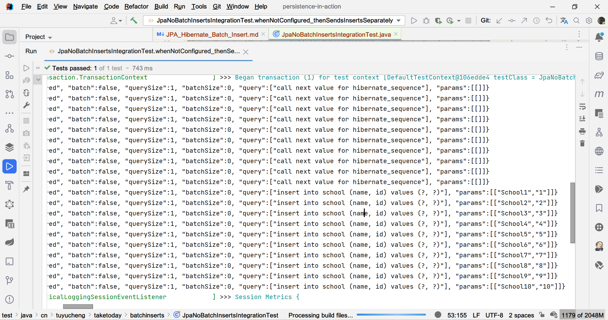
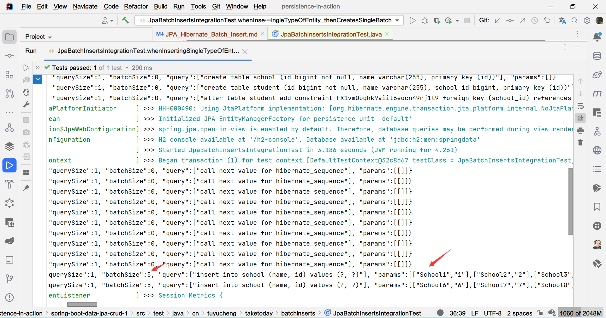
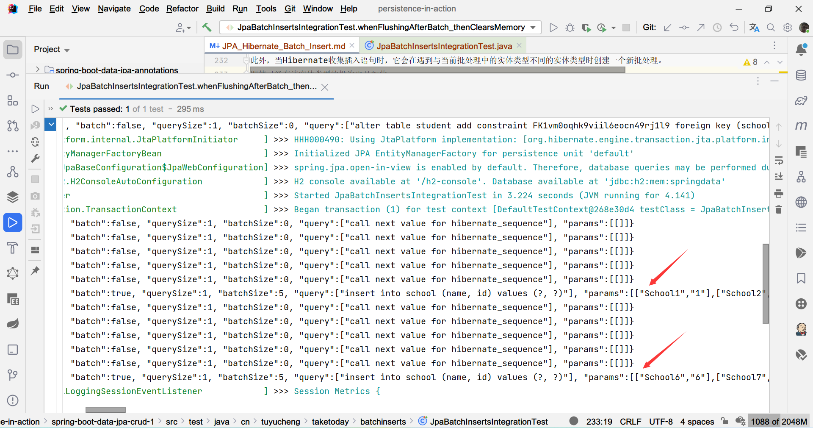
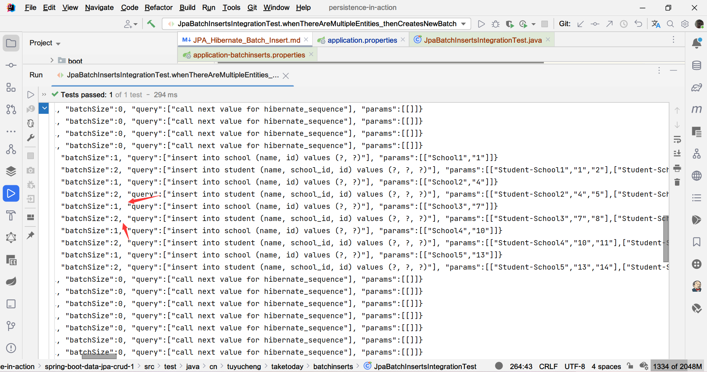
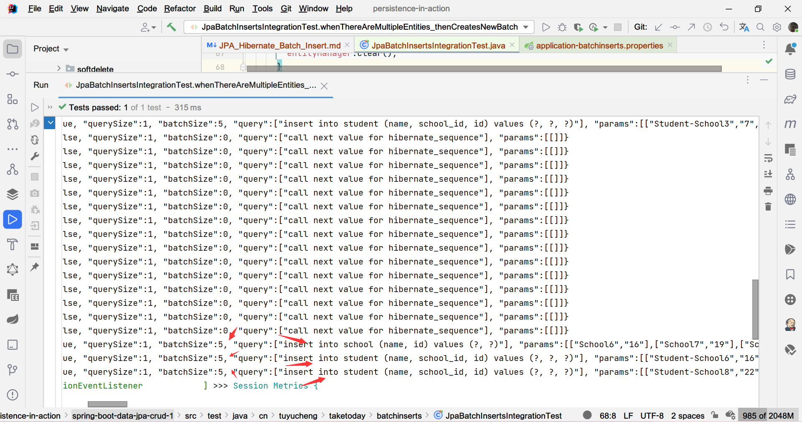
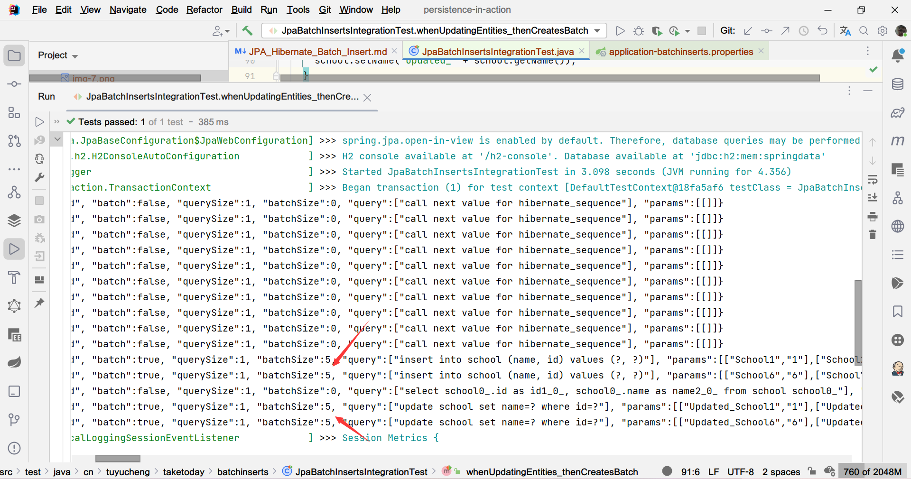

## 1. 概述

在本教程中，我们将学习如何使用Hibernate/JPA批量插入和更新实体。

批处理允许我们在单个网络调用中将一组SQL语句发送到数据库。这样，我们可以优化应用程序的网络和内存使用。

## 2. 项目构建

### 2.1 简单实体

让我们看看案例中使用的数据模型。

首先，我们将创建一个School实体：

```java

@Entity
@Setter
@Getter
public class School {

    @Id
    @GeneratedValue(strategy = GenerationType.SEQUENCE)
    private long id;

    private String name;

    @OneToMany(mappedBy = "school")
    private List<Student> students;
}
```

每个School有零或多个Student：

```java

@Entity
@Getter
@Setter
public class Student {

    @Id
    @GeneratedValue(strategy = GenerationType.SEQUENCE)
    private long id;

    private String name;

    @ManyToOne
    private School school;
}
```

## 2.2 跟踪Sql语句

在运行我们的案例时，我们需要验证insert/update语句是否确实是成批发送的。
不幸的是，我们无法从Hibernate日志语句判断SQL语句是否是批处理的。因此，我们将使用数据源代理来追踪Hibernate/JPA SQL语句：

```java

@Component
@Profile("batchinserts")
public class DatasourceProxyBeanPostProcessor implements BeanPostProcessor {

    @Override
    public Object postProcessBeforeInitialization(final Object bean, final String beanName) throws BeansException {
        return bean;
    }

    @Override
    public Object postProcessAfterInitialization(final Object bean, final String beanName) throws BeansException {
        if (bean instanceof DataSource) {
            ProxyFactory factory = new ProxyFactory(bean);
            factory.setProxyTargetClass(true);
            factory.addAdvice(new ProxyDataSourceInterceptor((DataSource) bean));
            return factory.getProxy();
        }
        return bean;
    }

    private record ProxyDataSourceInterceptor(DataSource dataSource) implements MethodInterceptor {

        private ProxyDataSourceInterceptor(final DataSource dataSource) {
            this.dataSource = ProxyDataSourceBuilder.create(dataSource).name("Batch-Insert-Logger").asJson().countQuery().logQueryToSysOut().build();
        }

        @Nullable
        @Override
        public Object invoke(@NotNull MethodInvocation invocation) throws Throwable {
            Method proxyMethod = ReflectionUtils.findMethod(dataSource.getClass(), invocation.getMethod().getName());
            if (proxyMethod != null)
                return proxyMethod.invoke(dataSource, invocation.getArguments());
            return invocation.proceed();
        }
    }
}
```

## 3. 默认行为

**Hibernate默认情况下不启用批处理**。这意味着它将为每个insert/update操作发送一条单独的SQL语句：

```java

@ExtendWith(SpringExtension.class)
@SpringBootTest(classes = JpaInsertApplication.class)
@Transactional
@ActiveProfiles("batchinserts")
@TestPropertySource(properties = "spring.jpa.properties.hibernate.jdbc.batch_size=-1")
class JpaNoBatchInsertsIntegrationTest {

    @PersistenceContext
    private EntityManager entityManager;

    @Test
    void whenNotConfigured_ThenSendsInsertsSeparately() {
        for (int i = 0; i < 10; i++) {
            School school = createSchool(i);
            entityManager.persist(school);
        }
    }

    @AfterEach
    void tearDown() {
        entityManager.flush();
    }
}
```

在这里，我们持久化10个School实体。如果查看日志，我们可以看到Hibernate分别发送每个insert语句：



因此，我们应该配置Hibernate以启用批处理。为此，**我们应该将hibernate.jdbc.batch_size属性的值设置为大于0的数字**。

如果我们手动创建EntityManager，我们应该将hibernate.jdbc.batch_size添加到Hibernate属性中：

```text
public Properties hibernateProperties() {
    Properties properties = new Properties();
    properties.put("hibernate.jdbc.batch_size", "5");
    
    // Other properties...
    return properties;
}
```

如果我们使用Spring Boot，我们可以将其定义为application.properties中的属性：

```properties
spring.jpa.properties.hibernate.jdbc.batch_size=5
```

## 4. 单表批处理

### 4.1 不显式刷新的批处理

让我们首先看看当我们只处理一种实体类型时，如何使用批量插入。

我们将使用前面的代码示例，但这次启用了批处理：

```java

@Transactional
@ActiveProfiles("batchinserts")
@ExtendWith(SpringExtension.class)
@SpringBootTest(classes = BatchInsertUpdateApplication.class)
class JpaBatchInsertsIntegrationTest {
    private static final int BATCH_SIZE = 5;
    @PersistenceContext
    private EntityManager entityManager;

    @Test
    void whenInsertingSingleTypeOfEntity_thenCreatesSingleBatch() {
        for (int i = 1; i <= 10; i++) {
            School school = createSchool(i);
            entityManager.persist(school);
        }
    }

    public School createSchool(int nameIdentifier) {
        School school = new School();
        school.setName("School" + (nameIdentifier));
        return school;
    }

    @AfterEach
    void tearDown() {
        entityManager.flush();
    }
}
```

在这里，我们持久化10个School实体。通过查看日志，我们可以验证Hibernate是否成批发送insert语句：



这里要提到的一个重要问题是内存消耗。**当我们持久化一个实体时，Hibernate将其存储在持久化上下文中**。
例如，如果我们在一个事务中持久化100000个实体，那么最终在内存中会有100000个实体实例，这可能会导致OutOfMemoryException。

### 4.2 显式刷新的批处理

现在我们将看看如何在批处理操作期间优化内存使用。让我们深入研究持久化上下文的作用。

首先，持久化上下文将新创建和修改的实体存储在内存中。当事务同步时，Hibernate将这些更改发送到数据库。
这通常发生在事务结束时。但是，**通过调用EntityManager.flush()也会触发事务同步**。

其次，持久化上下文作为实体缓存，也称为一级缓存。**要清除持久化上下文中的实体，我们可以调用EntityManager.clear()**。

因此，为了减少批处理期间的内存负载，
我们可以在达到批处理大小时在我们的应用程序代码上调用EntityManager.flush()和EntityManager.clear()：

```java
class JpaBatchInsertsIntegrationTest {

    @Test
    @Transactional
    void whenFlushingAfterBatch_thenClearsMemory() {
        for (int i = 1; i <= 10; i++) {
            if (i > 1 && i % BATCH_SIZE == 1) {
                entityManager.flush();
                entityManager.clear();
            }
            School school = createSchool(i);
            entityManager.persist(school);
        }
    }
}
```

在这里，我们刷新持久化上下文中的实体，从而使Hibernate向数据库发送查询。
此外，通过清除持久化上下文，我们将从内存中删除School实体。批处理行为将保持不变。



通过上图可以看到，当我们保存了5个School对象后，立即发送了一个Sql语句。

## 5. 多表执行批处理

现在让我们看看在一个事务中处理多个实体类型时如何配置批量插入。

当我们想要持久化几种类型的实体时，Hibernate会为每种实体类型创建不同的批次。这是因为**单个批次中只能有一种类型的实体**。

此外，当Hibernate收集插入语句时，它会在遇到与当前批处理中的实体类型不同的实体类型时创建一个新批处理。
即使已经有该实体类型的批次也是如此：

```java
class JpaBatchInsertsIntegrationTest {

    @Test
    @Transactional
    void whenThereAreMultipleEntities_thenCreatesNewBatch() {
        for (int i = 1; i <= 10; i++) {
            if (i > 1 && i % BATCH_SIZE == 1) {
                entityManager.flush();
                entityManager.clear();
            }

            School school = createSchool(i);
            entityManager.persist(school);
            Student firstStudent = createStudent(school);
            Student secondStudent = createStudent(school);
            entityManager.persist(firstStudent);
            entityManager.persist(secondStudent);
        }
    }
}
```

这里我们添加一个School，给它分配两个Student，并重复执行10次。

在日志中，我们看到Hibernate以大小为1的几个批次发送School insert语句，而我们预期的是2批大小为5的语句。
此外，Student insert语句也以大小为2的几个批次来发送，而不是4批大小为5的批次：



要批量处理相同实体类型的所有insert语句，**我们应该配置hibernate.order_inserts属性**。

我们可以使用EntityManagerFactory手动配置Hibernate属性：

```text
public Properties hibernateProperties() {
    Properties properties = new Properties();
    properties.put("hibernate.order_inserts", "true");
    
    // Other properties...
    return properties;
}
```

如果我们使用Spring Boot，我们可以在application.properties中配置以下属性：

```properties
spring.jpa.properties.hibernate.order_inserts=true
```

添加此属性后，Hibernate只会创建1个批次用于插入School，2个批次用于插入Student：



## 6. 批量更新

与批量执行插入类似，我们可以将几个update语句分组，然后一次性将它们发送到数据库。

要启用此功能，我们**需要配置hibernate.order_updates和hibernate.batch_versioned_data属性**。

```properties
spring.jpa.properties.hibernate.order_updates=true
spring.jpa.properties.hibernate.batch_versioned_data=true
```

如果我们手动创建EntityManagerFactory，可以通过编程方式设置属性：

```text
public Properties hibernateProperties() {
    Properties properties = new Properties();
    properties.put("hibernate.order_updates", "true");
    properties.put("hibernate.batch_versioned_data", "true");
    
    // Other properties...
    return properties;
}
```

配置完这些属性后，Hibernate应将update语句分批分组发送：

```java
class JpaBatchInsertsIntegrationTest {

    @Test
    void whenUpdatingEntities_thenCreatesBatch() {
        for (int i = 1; i <= 10; i++) {
            School school = createSchool(i);
            entityManager.persist(school);
        }
        entityManager.flush();
        TypedQuery<School> schoolQuery = entityManager.createQuery("select s from School s", School.class);
        List<School> allSchools = schoolQuery.getResultList();
        for (School school : allSchools) {
            school.setName("Updated_" + school.getName());
        }
    }
}
```

这里我们更新了School实体，Hibernate以2批大小为5的方式发送SQL语句：



## 7. @Id生成策略

当我们想对insert使用批处理时，我们应该注意主键的生成策略。
**如果我们的实体使用GenerationType.IDENTITY生成器，Hibernate将默认禁用批量插入**。

由于我们示例中的实体使用的是GenerationType.SEQUENCE生成器，这种情况下Hibernate启用批处理操作：

```text
@Id
@GeneratedValue(strategy = GenerationType.SEQUENCE)
private long id;
```

## 8. 总结

在本文中，我们演示了使用Hibernate/JPA进行批量插入和更新。