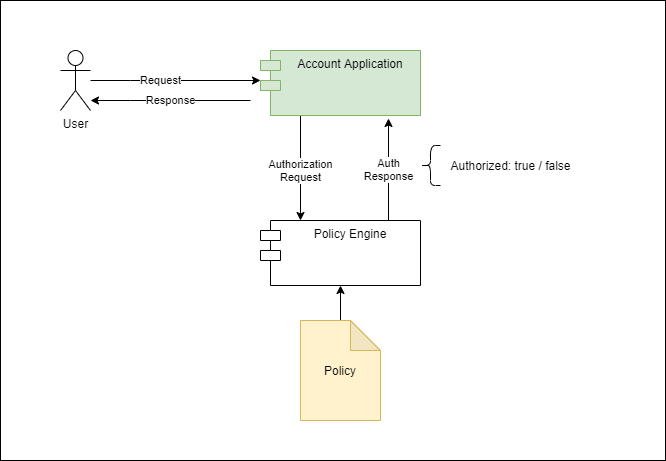

## 1. 概述

在本教程中，我们将展示如何将Spring Security的授权决策外部化到OPA——Open Policy Agent(开放策略代理)。

## 2. 前言：外部化授权案例

跨应用程序的一个共同要求是能够根据策略做出某些决定。当这个策略足够简单并且不太可能改变时，我们可以直接在代码中实现这个策略，这是最常见的场景。

但是，在其他情况下，我们需要更大的灵活性。访问控制决策是典型的：随着应用程序变得越来越复杂，
授予对给定功能的访问权限可能不仅取决于是谁，还取决于请求的其他上下文方面。这些方面可能包括IP地址、时间和登录身份验证方法(例如：“记住我”、OTP)等。

此外，将上下文信息与用户身份相结合的规则应该易于更改，最好不会导致应用程序停机。这一要求自然会导致一个专用服务处理策略评估请求的架构。

在这里，这种灵活性的权衡是增加的复杂性和调用外部服务所导致的性能损失。另一方面，我们可以在不影响应用的情况下，完全进化甚至替换授权服务。
此外，我们可以与多个应用程序共享此服务，从而允许在它们之间使用一致的授权模型。

## 3. 什么是OPA？

Open Policy Agent，简称OPA，是一个用Go实现的开源策略评估引擎。它最初由Styra开发，现在是CNCF毕业的项目。以下是该工具的一些典型用途列表：

+ Envoy授权过滤器
+ Kubernetes准入控制器
+ Terraform计划评估

安装OPA非常简单：只需下载我们平台的二进制文件，将其放在操作系统路径中的文件夹中，我们就可以开始了。我们可以使用一个简单的命令来验证它是否正确安装：

